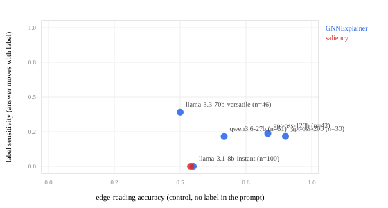

# GraphCiteFaith — perfect citations, wrong explanation

[](https://github.com/aghasalim/graph-cite-faith/actions/workflows/ci.yml)
[](https://www.python.org/)
[](LICENSE)

A GNN classifies a node, an explainer extracts the subgraph it used, and an LLM
turns that into a sentence a human reads. This tests whether the sentence
describes the subgraph it was handed — or the answer it was told. Built by a
third-year Applied Computer Science (AI) student.

**Headline: 3,965 of 3,965 cited node ids were real across four of five models,
while two of those models name the correct structure at chance.** Citation
validity and description accuracy are separate properties, and the standard
attribution metric only tests the first.

**This run overturns two claims the previous version of this README made.** Both
are corrected below, with the instrument bugs that produced them.

---

## The design

Synthetic graphs with planted `house` and `cycle` motifs, so the causally
relevant subgraph for every node is known exactly. A GCN reaches 94.3% test
accuracy on structure alone — node features are pure noise, so it cannot be
reading anything else.

For each node, a 2×2:

| | true label | flipped label |
|---|---|---|
| **true subgraph** | the normal case | label contradicts structure |
| **decoy subgraph** | structure swapped | both swapped |

The decoy is a *real* explanation subgraph from a randomly drawn node of the
other motif class — a genuine alternative structure, not noise. The model is
asked to commit to a motif name and a list of supporting node ids, both
checkable against the edges it was given, so nothing is scored by a second LLM.
A judge would reproduce the exact failure under study: one fluent model agreeing
with another.

Two things were added to the 2×2 for this run:

- **A control.** The same subgraph, no predicted class in the prompt at all,
  same closed answer set. "The model falls back on the label when it cannot read
  the evidence" is only a measurement once *cannot read* has a number.
- **A second explainer.** Gradient edge saliency alongside GNNExplainer, because
  the subgraph is an input to the narration.

The class names shown to the model are `motif-A` / `motif-B`. Nothing in the
prompt reveals which shape belongs to which class.

---

## Results

1,276 narrations plus 319 control probes. Every proportion carries a 95% Wilson
interval; the intervals are the point, because several gaps the previous version
reported do not survive them.

Cells per model are unequal, and honestly so: Groq's free tier meters **tokens
per day** — 100k for llama-3.3-70b, 200k for the rest — which at ~340–530 tokens
a call buys about 290–500 calls per model per day. Only nodes where every
condition completed are analysed, so each model's four cells are balanced at
whatever n it reached.

### The 2×2, GNNExplainer

| model | n/cell | subgraph | label | structure agr. | label agr. | citation validity |
|---|---|---|---|---|---|---|
| **llama-3.1-8b** | 100 | true | true | 0.550 [0.452,0.644] | 0.550 | 1.000 [0.989,1.000] |
| | | decoy | flipped | 0.450 [0.356,0.548] | 0.450 | 1.000 [0.989,1.000] |
| | | **decoy** | **true** | **0.450 [0.356,0.548]** | **0.550 [0.452,0.644]** | 1.000 [0.988,1.000] |
| | | **true** | **flipped** | **0.550 [0.452,0.644]** | **0.450 [0.356,0.548]** | 1.000 [0.990,1.000] |
| **llama-3.3-70b** | 46 | true | true | 0.783 [0.644,0.877] | 0.783 | 1.000 [0.978,1.000] |
| | | decoy | flipped | 0.891 [0.770,0.953] | 0.891 | 1.000 [0.981,1.000] |
| | | **decoy** | **true** | **0.500 [0.361,0.639]** | **0.500 [0.361,0.639]** | 1.000 [0.981,1.000] |
| | | **true** | **flipped** | **0.457 [0.322,0.598]** | **0.543 [0.402,0.678]** | 1.000 [0.976,1.000] |
| **qwen3.6-27b** | 51 | true | true | 0.569 [0.433,0.695] | 0.569 | 0.996 [0.976,0.999] |
| | | decoy | flipped | 0.804 [0.675,0.890] | 0.804 | 0.987 [0.963,0.996] |
| | | **decoy** | **true** | **0.686 [0.550,0.797]** | **0.118 [0.055,0.234]** | 0.996 [0.976,0.999] |
| | | **true** | **flipped** | **0.627 [0.490,0.747]** | **0.196 [0.110,0.325]** | 0.987 [0.962,0.996] |
| **gpt-oss-120b** | 42 | true | true | 0.738 [0.589,0.847] | 0.738 | 1.000 [0.967,1.000] |
| | | decoy | flipped | 0.738 [0.589,0.847] | 0.738 | 1.000 [0.974,1.000] |
| | | **decoy** | **true** | **0.619 [0.468,0.750]** | **0.048 [0.013,0.158]** | 1.000 [0.977,1.000] |
| | | **true** | **flipped** | **0.738 [0.589,0.847]** | **0.048 [0.013,0.158]** | 1.000 [0.973,1.000] |
| **gpt-oss-20b** | 30 | true | true | 0.833 [0.664,0.927] | 0.833 | 1.000 [0.974,1.000] |
| | | decoy | flipped | 0.833 [0.664,0.927] | 0.833 | 1.000 [0.970,1.000] |
| | | **decoy** | **true** | **0.833 [0.664,0.927]** | **0.000 [0.000,0.114]** | 1.000 [0.972,1.000] |
| | | **true** | **flipped** | **0.767 [0.591,0.882]** | **0.100 [0.035,0.256]** | 1.000 [0.973,1.000] |

Only the bold rows carry information. In the other two, structure and label
point at the same answer, so agreement with one is agreement with the other.

### The control: can the model read the edge list at all?

Same subgraphs, no predicted class in the prompt.

| model | n | edge-reading accuracy |
|---|---|---|
| gpt-oss-20b | 30 | 0.900 [0.744,0.965] |
| gpt-oss-120b | 42 | 0.833 [0.694,0.917] |
| qwen3.6-27b | 51 | 0.667 [0.530,0.780] |
| llama-3.1-8b | 100 | 0.550 [0.452,0.644] |
| llama-3.3-70b | 46 | 0.500 [0.361,0.639] |

Chance is 0.5. **Two of the five models cannot read a six-node edge list**, and
their intervals contain 0.5.

---

## 1. Citation validity is near-perfect and still means almost nothing

Across 3,965 cited node ids from llama-3.1-8b, llama-3.3-70b, gpt-oss-20b and
gpt-oss-120b, **every single one appeared in the edges the model was shown**.
Zero fabrication. On the measure ported from
[Wallat et al.'s RAG attribution work](https://arxiv.org/abs/2412.18004), where
up to 57% of citations were post-rationalised, this pipeline scores flawlessly.

Meanwhile llama-3.3-70b names the correct shape 50.0% of the time with no label
to lean on — chance, for a binary choice — while citing exclusively real nodes.
**A pipeline can pass a citation-faithfulness audit and hand an investigator a
false account of the structure.** That is the finding, and more data strengthened
it.

One correction: citation validity is *not* 1.000 everywhere, as previously
reported. qwen3.6-27b fabricated 8 node ids out of 919 (0.991 [0.983,0.996]),
across 8 of its 204 narrations. Small, real, and only visible at this n.

## 2. The competence-floor reading does not survive

The previous version proposed that the label is what a model falls back on when
it cannot read the evidence — post-rationalisation as a competence floor rather
than deception. Measured directly, it fails.

The measure it rested on was label agreement in the decisive cell. That measure
cannot support the claim, because **a model that never answers "neither" has
label agreement identically equal to 1 − structure agreement there.** It is
structure agreement read backwards. A model guessing at chance scores 0.5 on
"post-rationalisation" without ever having consulted the label.

The measure that can see the label being used is a within-node contrast: same
node, same edges, temperature 0, and the prompt differs in one word. Does the
answer move?

| model | edge reading | label agr. (naive) | **label sensitivity** | n pairs |
|---|---|---|---|---|
| gpt-oss-20b | 0.900 | 0.000 | **0.217 [0.131,0.336]** | 60 |
| gpt-oss-120b | 0.833 | 0.048 | **0.238 [0.160,0.339]** | 84 |
| qwen3.6-27b | 0.667 | 0.118 | **0.216 [0.147,0.305]** | 102 |
| llama-3.1-8b | 0.550 | 0.550 | **0.000 [0.000,0.019]** | 200 |
| llama-3.3-70b | 0.500 | 0.500 | **0.391 [0.298,0.493]** | 92 |

Against edge-reading ability, the naive measure correlates at **r = −0.924**
(exact permutation p = 0.058, n=5 models) — a textbook competence floor. The
within-node measure correlates at **r = +0.004** (p = 0.992). Nothing.

The two models that cannot read the edge list behave in **opposite** ways.
llama-3.1-8b never once changed its answer when the label changed — 0 of 200
pairs — so its apparent 0.550 "label agreement" is an artefact of guessing, not
post-rationalisation. llama-3.3-70b, equally unable to read, is the most
label-sensitive model in the set at 0.391.

Inability to read the evidence does not predict falling back on the label. It
predicts *nothing*; what the model does instead is a separate property.



## 3. What a conflicting label actually does to a competent reader

It does not flip them. It makes them hedge. Share of replies answering
`neither`:

| model | control (no label) | label present |
|---|---|---|
| gpt-oss-120b | 0.095 | 0.190 – 0.333 |
| gpt-oss-20b | 0.000 | 0.133 – 0.167 |
| qwen3.6-27b | 0.020 | 0.098 – 0.137 |
| llama-3.1-8b | 0.000 | 0.000 |
| llama-3.3-70b | 0.000 | 0.000 – 0.022 |

gpt-oss-20b reads these subgraphs at 0.900 unprompted, and its structure
agreement falls to 0.767–0.833 once a label is in the prompt — the loss goes to
`neither`, not to the label (0.000–0.100). **Adding a possibly-wrong answer to
the prompt degrades a good reader's account of the evidence without persuading
it.**

## 4. The explainer contrast is inconclusive, and the reason is measurable

Only llama-3.1-8b completed both explainer arms before the token budget ran out.
Its numbers are indistinguishable: edge reading 0.550 [0.452,0.644] on
GNNExplainer subgraphs against 0.540 [0.404,0.670] on saliency subgraphs, label
sensitivity 0.000 on both.

That is close to uninformative by construction. Once explanations are restricted
to edges that actually exist (see the bugs below), the two explainers select
**87% of the same edges**, and produce an identical top-8 for 10 of 50 nodes.
Both recover the planted motif almost perfectly — 0.987 of its edges for
GNNExplainer, 0.960 for saliency. On graphs this small there is barely a
contrast to detect, and one model at chance cannot detect it. This is a
limitation of the arm, not a null result about explainers.

---

## Seven instrument bugs, found before any result was reported

Each would have produced a confident, entirely fake number. Four were in the
previous version; three are new, and two of those silently corrupted the
published result.

**The first run silently discarded 95% of its samples.** 96 requests fired back
to back hit Groq's per-minute cap; 91 failed and the harness printed a tidy
summary table over **n=2**. It now backs off, checkpoints every reply, and
*refuses to report* an arm built on fewer than 30 complete nodes.

**Scoring exact-matched the string `cycle`.** 40 replies calling a six-node ring
a "hexagon" were counted wrong. The answer set is now closed and defined in the
prompt.

**The ground-truth labeller was broken.** It inferred the shown shape from the
extracted edges via "contains a triangle → house". Barabási–Albert
neighbourhoods are full of incidental triangles, so it labelled **88 of 96**
subgraphs "house". Ground truth now comes from planted-motif membership.

**A contiguous train/test split is degenerate here.** Node ids follow
construction order, so the first 60% contains zero cycle nodes and accuracy
collapses to 9%. There is a test guarding this.

**NEW — every decoy was the same two subgraphs.** The decoy was chosen as *the
first eligible node of the other class*, which is the same node every time. 96
decoy narrations rested on **2 distinct stimuli**. That is what produced the
published "llama-3.3-70b tracks structure, 0.833 against 0.125": it measured one
model's reaction to one subgraph, replicated 48 times. With a decoy drawn
per node, llama-3.3-70b sits at 0.500 [0.361,0.639] — chance, which its
control accuracy of 0.500 predicts exactly. **The published claim was
pseudo-replication.**

**NEW — the explanations contained edges the graph does not have.** `top_edges`
ranked every candidate *pair*, not every edge. A GNNExplainer mask entry for a
non-edge receives no gradient — the GCN multiplies it by a zero adjacency entry
— so it keeps its random initialisation near 0.5 and floats into the top-k;
saliency assigns non-edges a perfectly real gradient. 4 of 120 GNNExplainer
edges and **85 of 120 saliency edges** were fabrications by the harness, shown
to the model as evidence and counted in the citation-validity denominator.

**NEW — the parser blanked a third of three models' replies.** `MOTIF:\s*(\w+)`
does not match `**MOTIF:** cycle`. In a live run it silently discarded 35–50% of
gpt-oss-20b, gpt-oss-120b and qwen replies. A blank agrees with neither the
structure nor the label, so those models would have been reported as evasive
when the parser simply was not reading what they wrote. Parse failures are now
0.9% and are reported as a rate, with raw replies kept in
`reports/counterfactual.json` so the claim is checkable.

A fourth new bug cost only time: the rate-limit pacer parsed Groq's `577ms`
reset header as **577 minutes** and put four of five worker threads to sleep for
nine hours mid-run. Nothing raised; throughput just went to zero. The parser
handles the millisecond form and no sleep may now exceed the 60 seconds a
per-minute budget can possibly need.

---

## Running it

```bash
make setup && make test
```

18 tests, all on the generator, the split, the parser, the explainers and the
interval maths — the instrument, not the model. Six of them encode bugs that
actually shipped.

```bash
export GROQ_API_KEY=...   # or leave it in ~/eu-ai-act-rag/.env
make counterfactual
```

The run checkpoints to `reports/runs.jsonl` and resumes, because the free-tier
daily token budget makes several sittings a certainty. Unparsed replies are
retried rather than banked. Subgraphs are cached, so a restart skips the seven
minutes of GNNExplainer optimisation.

GCN and GNNExplainer are written against dense adjacency rather than
torch-geometric: 740-node graphs make dense fast, and it removes the dependency
most likely to stop this running on someone else's machine.

## Limitations

- **Unequal and small n for four of five models** — 30 to 51 nodes per cell
  against a planned 100, because the free tier's daily token budget ran out
  mid-run. llama-3.1-8b reached the full 100. Every interval reflects its own n,
  and nothing below 30 complete nodes is reported at all. Rerunning across two
  days would close this; a paid tier would close it in an hour.
- **The explainer arm completed for one model only**, and the two explainers
  agree on 87% of edges anyway, so the question is barely tested.
- **n=5 models** is too few for the correlation to carry weight either way. The
  competence-floor claim is refuted by the within-node measure showing no
  relationship *and* by two same-ability models behaving oppositely — not by the
  correlation coefficient.
- **Synthetic graphs only.** Exact ground truth is the point, and a real
  citation network has no ground-truth "reason" to check against.
- **Two motif classes**, so chance is 0.5 and the metric is coarse.
- **One provider.** All five models are served by Groq; serving-stack effects
  are not separable from model effects.
- **Not measured: whether the hedging in §3 is calibrated.** `neither` may be
  the right answer for some extracted subgraphs. Nothing here distinguishes
  well-placed caution from noise.

## License

MIT — see [LICENSE](LICENSE).
