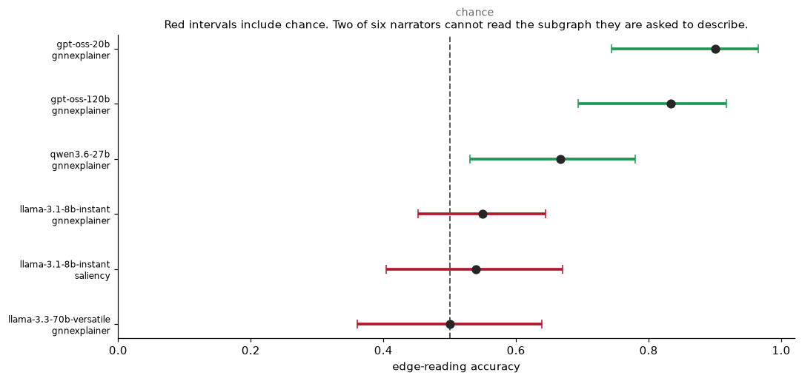
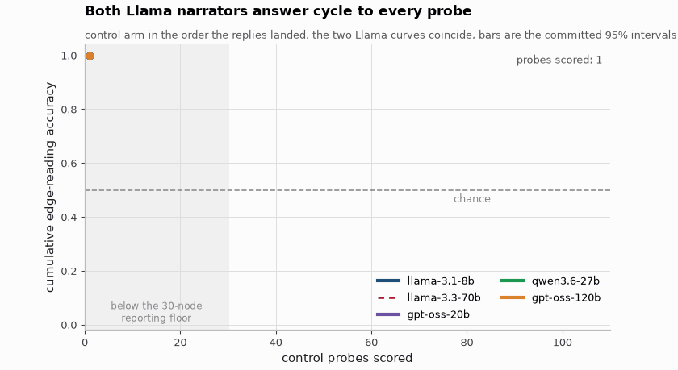
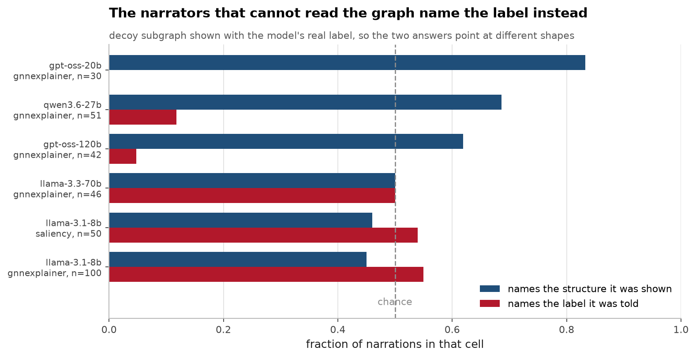
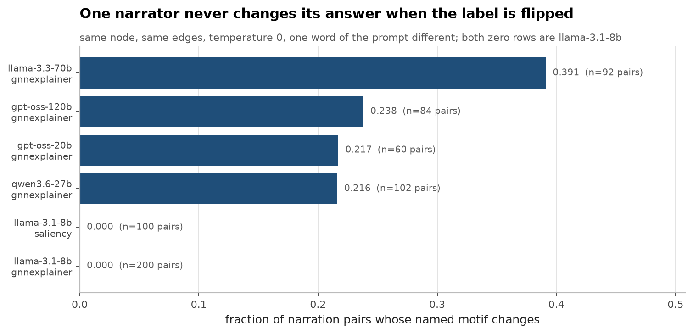
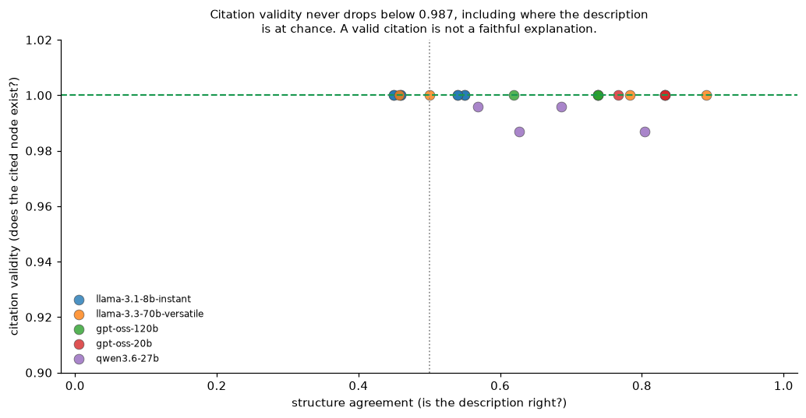
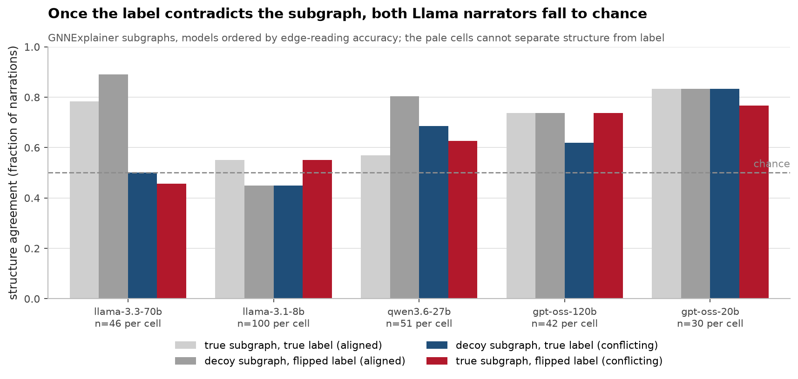

# GraphCiteFaith, perfect citations, wrong explanation

[](https://github.com/aghasalim/graph-cite-faith/actions/workflows/ci.yml)
[](https://www.python.org/)
[](LICENSE)

A GNN classifies a node, an explainer extracts the subgraph it used, and an LLM
turns that into a sentence a human reads. This tests whether the sentence
describes the subgraph it was handed, or the answer it was told. Built by a
third-year Applied Computer Science (AI) student.

**Headline: 3,965 of 3,965 cited node ids were real across four of five models,
while two of those models name the correct structure at chance.** Citation
validity and description accuracy are separate properties, and the standard
attribution metric only tests the first.

**This run overturns two claims the previous version of this README made.** Both
are corrected below, with the instrument bugs that produced them.

---


---

## Abstract

When an LLM narrates a GNN explanation, does the text describe the subgraph it
was handed, or paraphrase the label it was told? This work separates those by
construction: narrations are elicited over subgraphs that are either the model's
real explanation or a decoy, with a label that is either the model's prediction
or its opposite, and the resulting text is scored for structure agreement and
label agreement independently.

The answer turns out to be a capability question before it is an explainability
one. Across six narrator configurations, edge-reading accuracy ranges from 0.50
chance, for Llama-3.1-8B to 0.90 for GPT-OSS-20B. The weakest narrators track the
label they were given and ignore the graph entirely, with label sensitivity of
exactly 0.000: their text does not change at all when the label is flipped, so it
is neither reading the structure nor the label but producing boilerplate that
agrees with the label about half the time.

Citation validity is the cautionary result. It never drops below 0.987 and sits
at exactly 1.000 in 20 of 24 cells, while structure agreement over the same
narrations spans 0.450 to 0.891. A metric pinned near its ceiling regardless of
whether the description is correct cannot be used as evidence of faithfulness,
which is precisely how citation checks are often reported.

**Contributions.** (i) A decoy-subgraph and flipped-label design that separates
structure-following from label-following. (ii) A competence control showing
whether a narrator can read the graph at all, which turns out to determine
everything downstream. (iii) Evidence that citation validity is uninformative
about narration faithfulness. (iv) Seven instrument bugs found and documented
before any result was reported.

---

## 1. The design

Synthetic graphs with planted`house` and`cycle` motifs, so the causally
relevant subgraph for every node is known exactly. A GCN reaches 94.3% test
accuracy on structure alone, node features are pure noise, so it cannot be
reading anything else.

For each node, a 2×2:

| | true label | flipped label |
|---|---|---|
| **true subgraph** | the normal case | label contradicts structure |
| **decoy subgraph** | structure swapped | both swapped |

The decoy is a *real* explanation subgraph from a randomly drawn node of the
other motif class, a genuine alternative structure, not noise. The model is
asked to commit to a motif name and a list of supporting node ids, both
checkable against the edges it was given, so nothing is scored by a second LLM.
A judge would reproduce the exact failure under study: one fluent model agreeing
with another.

Two things were added to the 2×2 for this run:

- **A control.** The same subgraph, no predicted class in the prompt at all,
  same closed answer set. "The model falls back on the label when it cannot read
  the evidence" is only a measurement once *cannot read* has a number.
- **A second explainer.** Gradient edge saliency alongside GNNExplainer, because
  the subgraph is an input to the narration.

The class names shown to the model are`motif-A` /`motif-B`. Nothing in the
prompt reveals which shape belongs to which class.

---

## 2. Results
Label sensitivity of exactly 0.000 is the sharpest number here.




*The same control probes scored one at a time in the order the replies landed: the running accuracy per model is what moves, the axes and the 0.5 chance line stay fixed, and each curve ends on the number it reports in the control table below.*




Full detail in [notes/METHODS.md](notes/METHODS.md#2-results).
### The 2×2, GNNExplainer
| model | n/cell | subgraph | label | structure agr.

Full detail in [notes/METHODS.md](notes/METHODS.md#the-22-gnnexplainer).
### The control: can the model read the edge list at all?

Same subgraphs, no predicted class in the prompt.

| model | n | edge-reading accuracy |
|---|---|---|
| gpt-oss-20b | 30 | 0.900 [0.744,0.965] |
| gpt-oss-120b | 42 | 0.833 [0.694,0.917] |
| qwen3.6-27b | 51 | 0.667 [0.530,0.780] |
| llama-3.1-8b | 100 | 0.550 [0.452,0.644] |
| llama-3.3-70b | 46 | 0.500 [0.361,0.639] |

Chance is 0.5. **Two of the five models cannot read a six-node edge list**, and
their intervals contain 0.5.

---



### 2.1 Citation validity is near-perfect and still means almost nothing

Across 3,965 cited node ids from llama-3.1-8b, llama-3.3-70b, gpt-oss-20b and
gpt-oss-120b, **every single one appeared in the edges the model was shown**.
Zero fabrication. On the measure ported from
[Wallat et al.'s RAG attribution work](https://arxiv.org/abs/2412.18004), where
up to 57% of citations were post-rationalised, this pipeline scores flawlessly.

Meanwhile llama-3.3-70b names the correct shape 50.0% of the time with no label
to lean on, chance, for a binary choice, while citing exclusively real nodes.
**A pipeline can pass a citation-faithfulness audit and hand an investigator a
false account of the structure.** That is the finding, and more data strengthened
it.

One correction: citation validity is *not* 1.000 everywhere, as previously
reported. qwen3.6-27b fabricated 8 node ids out of 919 (0.991 [0.983,0.996]),
across 8 of its 204 narrations. Small, real, and only visible at this n.

### 2.2 The competence-floor reading does not survive

The previous version proposed that the label is what a model falls back on when
it cannot read the evidence, post-rationalisation as a competence floor rather
than deception. Measured directly, it fails.

The measure it rested on was label agreement in the decisive cell. That measure
cannot support the claim, because **a model that never answers "neither" has
label agreement identically equal to 1 − structure agreement there.** It is
structure agreement read backwards. A model guessing at chance scores 0.5 on
"post-rationalisation" without ever having consulted the label.

The measure that can see the label being used is a within-node contrast: same
node, same edges, temperature 0, and the prompt differs in one word. Does the
answer move?

| model | edge reading | label agr. (naive) | **label sensitivity** | n pairs |
|---|---|---|---|---|
| gpt-oss-20b | 0.900 | 0.000 | **0.217 [0.131,0.336]** | 60 |
| gpt-oss-120b | 0.833 | 0.048 | **0.238 [0.160,0.339]** | 84 |
| qwen3.6-27b | 0.667 | 0.118 | **0.216 [0.147,0.305]** | 102 |
| llama-3.1-8b | 0.550 | 0.550 | **0.000 [0.000,0.019]** | 200 |
| llama-3.3-70b | 0.500 | 0.500 | **0.391 [0.298,0.493]** | 92 |

Against edge-reading ability, the naive measure correlates at **r = −0.924**
(exact permutation p = 0.058, n=5 models), a textbook competence floor. The
within-node measure correlates at **r = +0.004** (p = 0.992). Nothing.

The two models that cannot read the edge list behave in **opposite** ways.
llama-3.1-8b never once changed its answer when the label changed, 0 of 200
pairs, so its apparent 0.550 "label agreement" is an artefact of guessing, not
post-rationalisation. llama-3.3-70b, equally unable to read, is the most
label-sensitive model in the set at 0.391.

Inability to read the evidence does not predict falling back on the label. It
predicts *nothing*; what the model does instead is a separate property.




### 2.3 What a conflicting label actually does to a competent reader
Share of replies answering `neither`: | model | control (no label) | label present | |---|---|---| | gpt-oss-120b | 0.095 | 0.190 to 0.333 | | gpt-oss-20b | 0.000 | 0.133 to 0.167 | | qwen3.6-27b | 0.020 | 0.098 to 0.137 | | llama-3.1-8b | 0.000 | 0.000 | | llama-3.3-70b | 0.000 | 0.000 to 0.022 | gpt-oss-20b reads these subgraphs at 0.900 unprompted, and its structure agreement falls to 0.767 to 0.833 once a label is in the prompt, the loss goes to `neither`, not to the label (0.000 to 0.100).

Full detail in [notes/METHODS.md](notes/METHODS.md#23-what-a-conflicting-label-actually-does-to-a-competent-reader).
### 2.4 The explainer contrast is inconclusive, and the reason is measurable
Only llama-3.1-8b completed both explainer arms before the token budget ran out.

Full detail in [notes/METHODS.md](notes/METHODS.md#24-the-explainer-contrast-is-inconclusive-and-the-reason-is-measurable).
## 3. Seven instrument bugs, found before any result was reported
Each would have produced a confident, entirely fake number.

Full detail in [notes/METHODS.md](notes/METHODS.md#3-seven-instrument-bugs-found-before-any-result-was-reported).
## 4. Running it

```bash
make setup && make test
```

18 tests, all on the generator, the split, the parser, the explainers and the
interval maths, the instrument, not the model. Six of them encode bugs that
actually shipped.

```bash
export GROQ_API_KEY=...   # or leave it in ~/eu-ai-act-rag/.env
make counterfactual
```

The run checkpoints to`reports/runs.jsonl` and resumes, because the free-tier
daily token budget makes several sittings a certainty. Unparsed replies are
retried rather than banked. Subgraphs are cached, so a restart skips the seven
minutes of GNNExplainer optimisation.

GCN and GNNExplainer are written against dense adjacency rather than
torch-geometric: 740-node graphs make dense fast, and it removes the dependency
most likely to stop this running on someone else's machine.

## 5. Limitations

- **Unequal and small n for four of five models**: 30 to 51 nodes per cell
  against a planned 100, because the free tier's daily token budget ran out
  mid-run. llama-3.1-8b reached the full 100. Every interval reflects its own n,
  and nothing below 30 complete nodes is reported at all. Rerunning across two
  days would close this; a paid tier would close it in an hour.
- **The explainer arm completed for one model only**, and the two explainers
  agree on 87% of edges anyway, so the question is barely tested.
- **n=5 models** is too few for the correlation to carry weight either way. The
  competence-floor claim is refuted by the within-node measure showing no
  relationship *and* by two same-ability models behaving oppositely, not by the
  correlation coefficient.
- **Synthetic graphs only.** Exact ground truth is the point, and a real
  citation network has no ground-truth "reason" to check against.
- **Two motif classes**, so chance is 0.5 and the metric is coarse.
- **One provider.** All five models are served by Groq; serving-stack effects
  are not separable from model effects.
- **Not measured: whether the hedging in §3 is calibrated.**`neither` may be
  the right answer for some extracted subgraphs. Nothing here distinguishes
  well-placed caution from noise.

## 6. Licence

MIT, see [LICENSE](LICENSE).

## References

The papers and sources this implementation follows. Each one is here because
the code uses the method, the dataset or the metric it describes.

- **Ying, Bourgeois, You, Zitnik, Leskovec. GNNExplainer: Generating Explanations for Graph Neural Networks. NeurIPS 2019.** [arXiv:1903.03894](https://arxiv.org/abs/1903.03894) the explanation the narration is checked against.
- **Kipf, Welling. Semi-Supervised Classification with Graph Convolutional Networks. ICLR 2017.** [arXiv:1609.02907](https://arxiv.org/abs/1609.02907) the GCN being explained.
- **Jacovi, Goldberg. Towards Faithfully Interpretable NLP Systems. ACL 2020.** [arXiv:2004.03685](https://arxiv.org/abs/2004.03685) the definition of faithfulness this repo measures against.
