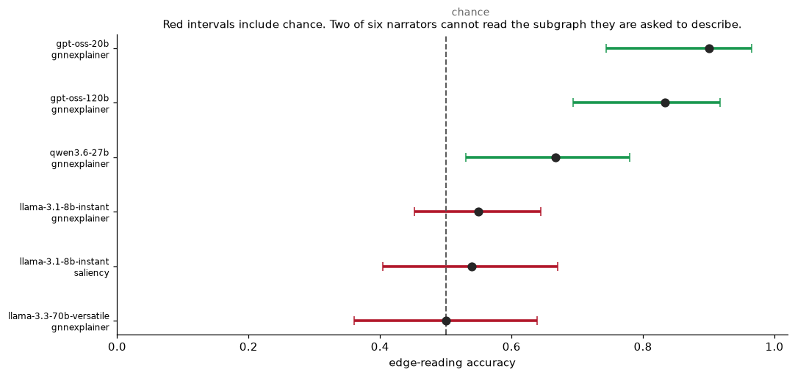
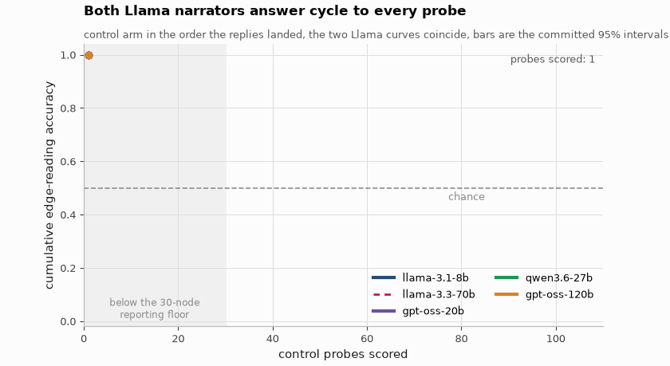
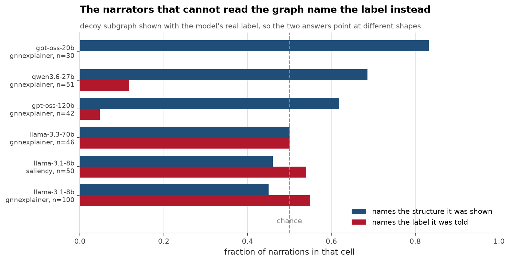
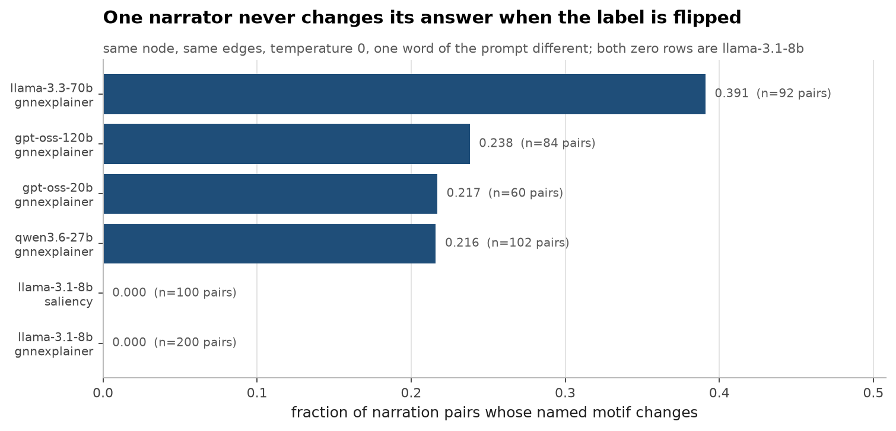
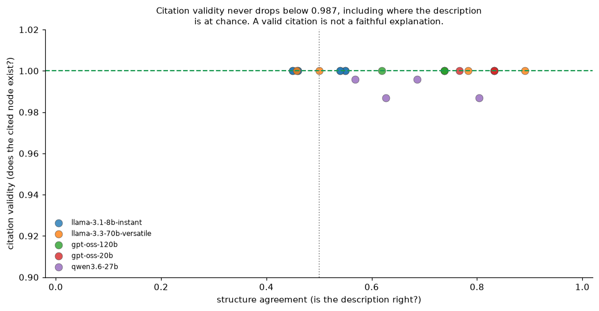
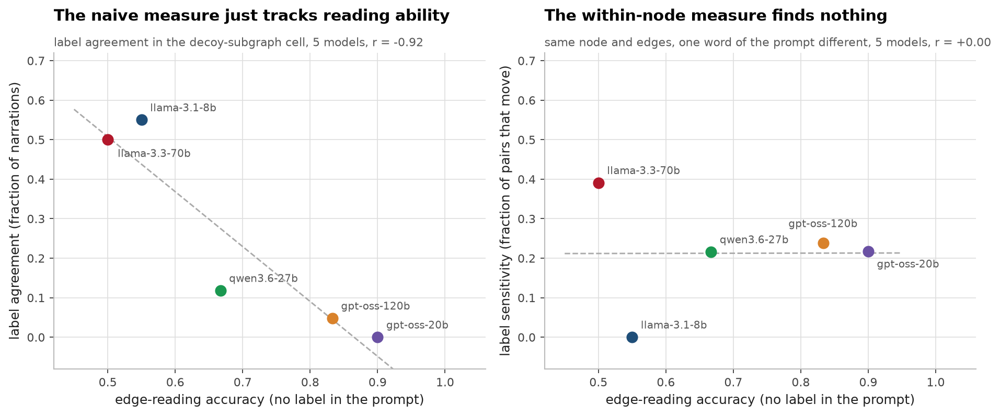
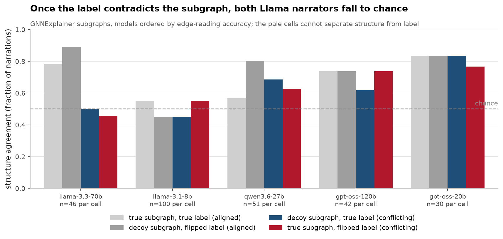

# GraphCiteFaith, perfect citations, wrong explanation

[](https://github.com/aghasalim/graph-cite-faith/actions/workflows/ci.yml)
[](https://www.python.org/)
[](LICENSE)
[](https://doi.org/10.5281/zenodo.23003633)

A GNN classifies a node. An explainer pulls out the subgraph it used, and an LLM
turns that into a sentence a person reads. I wanted to know whether that
sentence describes the subgraph the LLM was handed, or just the answer it was told.

In this run, 3,965 of 3,965 cited node ids were real across four of five models.
Yet two of those models name the correct structure only at chance. So citation
validity and description accuracy are separate things, and the usual
attribution metric only checks the first one.

This run also overturns two claims I made in the previous version of this
README. I correct both below and show the instrument bugs that caused them.

---

## Abstract

When an LLM narrates a GNN explanation, does the text describe the subgraph it
was given, or does it paraphrase the label it was told? I set the experiment up
so the two can be told apart. Each narration is produced over either the
model's real explanation subgraph or a decoy. The label in the prompt is either
the model's prediction or its opposite. Then I score the text for structure
agreement and label agreement separately.

It turned out to be a question about capability first and explainability
second. I tried six narrator configurations. Across them, edge-reading accuracy
ranges from 0.50, chance, for Llama-3.3-70B to 0.90 for GPT-OSS-20B.
Llama-3.1-8B is no better at 0.55, and its interval still contains 0.5. Its
label sensitivity is exactly 0.000. That means over 200 flipped pairs the
narration never changed when the label changed. So it follows neither the
structure nor the label. It writes boilerplate that agrees with the label about
half the time.

Citation validity is the warning sign. It never drops below 0.987 and sits at
exactly 1.000 in 20 of 24 cells. Meanwhile, structure agreement over the same
narrations spans 0.450 to 0.891. A metric that stays near its ceiling whether
or not the description is right can't count as evidence of faithfulness. That's
exactly how citation checks often get reported.

What I think this adds. First, a decoy-subgraph and flipped-label design that
pulls structure-following apart from label-following. Second, a competence
control that checks whether a narrator can read the graph at all. That ended up
deciding everything downstream. Third, evidence that citation validity tells
you nothing about narration faithfulness. Last, seven instrument bugs that I
found and documented before reporting any result.

---

## 1. The design

I use synthetic graphs with planted `house` and `cycle` motifs, so I know
exactly which subgraph matters causally for every node. A GCN reaches 94.3%
test accuracy on structure alone. The node features are pure noise, so there's
nothing else it could be reading.

Each node gets a 2×2 design.

| | true label | flipped label |
|---|---|---|
| **true subgraph** | the normal case | label contradicts structure |
| **decoy subgraph** | structure swapped | both swapped |

The decoy is a *real* explanation subgraph, taken from a randomly drawn node of
the other motif class, so it's a genuine alternative structure. I ask the model
to commit to a motif name and a list of supporting node ids. Both can be
checked against the edges it was given, so no second LLM does any scoring. A
judge model would just repeat the failure I'm studying, one fluent model
agreeing with another.

For this run I added two things to the 2×2.

The first is a control. It uses the same subgraph and the same closed answer
set, with no predicted class in the prompt at all. "The model falls back on the
label when it cannot read the evidence" only becomes a measurement once
*cannot read* has a number.

The second is another explainer. I run gradient edge saliency next to
GNNExplainer, because the subgraph is an input to the narration too.

The model only sees the class names `motif-A` /`motif-B`, and nothing in the
prompt says which shape goes with which class.

---

## 2. Results
The sharpest number here is a label sensitivity of exactly 0.000. Over 200
flipped pairs, llama-3.1-8b never changed its answer when the label changed. So
it isn't following the label either. It writes boilerplate that agrees with the
label about half the time. The run behind these numbers is 1,276 narrations plus
319 control probes. Every proportion has a 95% Wilson interval, because several
gaps I reported in the previous version don't survive them. The implementations
in `verify/` recompute every published proportion and interval from the
per-narration records. They share no code with the analysis, and CI fails if
any of them disagrees.





*Control probes scored one at a time, in the order the replies landed. Each curve ends on the number it reports in the table below, so you can watch how long it takes to get there against the 0.5 chance line.*




Full detail in [notes/METHODS.md](notes/METHODS.md#2-results).
### The 2×2, GNNExplainer

Only two of the four cells carry information. Those are the ones where the
structure and the label point at different answers. In them gpt-oss-20b keeps
describing the subgraph it was shown. On a decoy it gets 0.833 [0.664,0.927]
structure agreement against 0.000 [0.000,0.114] label agreement. llama-3.1-8b
stays inside the 0.450 to 0.550 band in all four cells. llama-3.3-70b scores
0.783 and 0.891 where structure and label agree. Where they conflict it gets
0.500 and 0.457, which is chance.

Full detail in [notes/METHODS.md](notes/METHODS.md#the-22-gnnexplainer).
### The control: can the model read the edge list at all?

Same subgraphs as before, but with no predicted class in the prompt.

| model | n | edge-reading accuracy |
|---|---|---|
| gpt-oss-20b | 30 | 0.900 [0.744,0.965] |
| gpt-oss-120b | 42 | 0.833 [0.694,0.917] |
| qwen3.6-27b | 51 | 0.667 [0.530,0.780] |
| llama-3.1-8b | 100 | 0.550 [0.452,0.644] |
| llama-3.3-70b | 46 | 0.500 [0.361,0.639] |

Chance is 0.5. Two of the five models can't read a six-node edge list, and
their intervals contain 0.5.

---



### 2.1 Citation validity is near-perfect and still means almost nothing

Across 3,965 cited node ids from llama-3.1-8b, llama-3.3-70b, gpt-oss-20b and
gpt-oss-120b, every one appeared in the edges the model was shown. Nothing was
made up. I ported this measure from
[Wallat et al.'s RAG attribution work](https://arxiv.org/abs/2412.18004), where
up to 57% of citations were post-rationalised. On it, this pipeline scores
perfectly.

But with no label to lean on, llama-3.3-70b names the correct shape 50.0% of
the time. For a binary choice that's chance, and it still only cites real
nodes. So a pipeline can pass a citation-faithfulness audit and still give an
investigator a false account of the structure. That's the main finding, and the
extra data made it stronger.

I need to correct one thing. Citation validity is *not* 1.000 everywhere, as I
reported before. qwen3.6-27b fabricated 8 node ids out of 919 (0.991 [0.983,0.996]),
across 8 of its 204 narrations. It's small, but it's real, and it only shows up
at this n.

### 2.2 The competence-floor reading does not survive

In the previous version I proposed that a model falls back on the label when it
can't read the evidence. I called it post-rationalisation as a competence
floor, and I didn't read it as deception. When I measured it directly, it
didn't hold up.

That idea rested on label agreement in the decisive cell, and that measure
can't support it. In that cell, a model that never answers "neither" has label
agreement identically equal to 1 − structure agreement. It's just structure
agreement read backwards. A model guessing at chance scores 0.5 on
"post-rationalisation" without ever looking at the label.

To see whether the label actually gets used, I need a within-node contrast.
Same node, same edges, temperature 0, and the prompt differs by one word. Then
I check whether the answer moves.

| model | edge reading | label agr. (naive) | **label sensitivity** | n pairs |
|---|---|---|---|---|
| gpt-oss-20b | 0.900 | 0.000 | **0.217 [0.131,0.336]** | 60 |
| gpt-oss-120b | 0.833 | 0.048 | **0.238 [0.160,0.339]** | 84 |
| qwen3.6-27b | 0.667 | 0.118 | **0.216 [0.147,0.305]** | 102 |
| llama-3.1-8b | 0.550 | 0.550 | **0.000 [0.000,0.019]** | 200 |
| llama-3.3-70b | 0.500 | 0.500 | **0.391 [0.298,0.493]** | 92 |

Against edge-reading ability, the naive measure correlates at r = −0.924
(exact permutation p = 0.058, n=5 models). That looks like a textbook
competence floor. The within-node measure correlates at r = +0.004
(p = 0.992), which is nothing.

The two models that can't read the edge list behave in opposite ways.
llama-3.1-8b never once changed its answer when the label changed (0 of 200
pairs). Its apparent 0.550 "label agreement" comes from guessing. It isn't
post-rationalisation. llama-3.3-70b can't read the list either, yet it's the
most label-sensitive model in the set at 0.391.

So not being able to read the evidence doesn't predict falling back on the
label. It predicts *nothing*. What the model does instead is a separate
property.





### 2.3 What a conflicting label actually does to a competent reader
It doesn't flip them. It makes them hedge. Here's the share of replies
answering `neither`.

| model | control (no label) | label present |
|---|---|---|
| gpt-oss-120b | 0.095 | 0.190 to 0.333 |
| gpt-oss-20b | 0.000 | 0.133 to 0.167 |
| qwen3.6-27b | 0.020 | 0.098 to 0.137 |
| llama-3.1-8b | 0.000 | 0.000 |
| llama-3.3-70b | 0.000 | 0.000 to 0.022 |

Unprompted, gpt-oss-20b reads these subgraphs at 0.900. Once a label is in the
prompt, its structure agreement falls to 0.767 to 0.833. What it loses goes to
`neither`. Very little goes to the label (0.000 to 0.100).

Full detail in [notes/METHODS.md](notes/METHODS.md#23-what-a-conflicting-label-actually-does-to-a-competent-reader).
### 2.4 The explainer contrast is inconclusive, and the reason is measurable
Only llama-3.1-8b finished both explainer arms before the token budget ran out.
Its two arms look the same. Edge reading is 0.550 [0.452,0.644] on GNNExplainer
subgraphs and 0.540 [0.404,0.670] on saliency subgraphs. Label sensitivity is
0.000 on both. There's barely a contrast to detect anyway. The arm covers 50
nodes, and for 30 of them the two explainers return the same edge set. Both
recover nearly all of the planted motif, 0.987 of its edges for GNNExplainer
and 0.960 for saliency. That's a limitation of the arm.

Full detail in [notes/METHODS.md](notes/METHODS.md#24-the-explainer-contrast-is-inconclusive-and-the-reason-is-measurable).
## 3. Seven instrument bugs, found before any result was reported
Each of these would have given me a confident number that was completely fake.
The most expensive one was the decoy. It was always the first eligible node of
the other class. That meant 96 decoy narrations rested on just 2 distinct
stimuli. The published "llama-3.3-70b tracks structure at 0.833" was really one
model reacting to one subgraph, repeated 48 times. Once I drew the decoy per
node, that model sits at 0.500, which is chance.

Two more of the seven are worth naming. The harness showed the model edges the
graph doesn't have, 85 of 120 saliency edges. And a regex that couldn't match
`**MOTIF:** cycle` silently threw away 35 to 50% of three models' replies.
Parse failures are now 0.9%.

Full detail in [notes/METHODS.md](notes/METHODS.md#3-seven-instrument-bugs-found-before-any-result-was-reported).
## 4. Running it

```bash
make setup && make test
```

There are 18 tests, and they all target the instrument. That means the
generator, the split, the parser, the explainers and the interval maths. Six of
them encode bugs that actually shipped.

```bash
export GROQ_API_KEY=...
make counterfactual
```

The run checkpoints to `reports/runs.jsonl` and can resume. With the free
tier's daily token budget, you'll need several sittings. Unparsed replies get
retried and are never banked. Subgraphs are cached, so a restart skips the
seven minutes of GNNExplainer optimisation.

I wrote GCN and GNNExplainer against dense adjacency, without torch-geometric.
With 740-node graphs, dense is fast. It also drops the dependency most likely
to stop this running on someone else's machine.

## 5. Limitations

- Unequal and small n for four of five models. Cells have 30 to 51 nodes
  against a planned 100, because the free tier's daily token budget ran out
  mid-run. llama-3.1-8b reached the full 100. Every interval reflects its own n,
  and I don't report anything below 30 complete nodes at all. Rerunning across
  two days would fix this. A paid tier would fix it in an hour.
- The explainer arm only finished for one model. The two explainers also agree
  on 87% of edges, so the question is barely tested.
- n=5 models is too few for the correlation to carry weight either way. I
  refute the competence-floor claim with the within-node measure showing no
  relationship *and* with two models of the same ability behaving in opposite
  ways.
- Synthetic graphs only. Exact ground truth is the point here, and a real
  citation network has no ground-truth "reason" to check against.
- Two motif classes, so chance is 0.5 and the metric is coarse.
- One provider. Groq serves all five models, so I can't separate serving-stack
  effects from model effects.
- I didn't measure whether the hedging in §3 is calibrated. `neither` might be
  the right answer for some extracted subgraphs. Nothing here tells well-placed
  caution apart from noise.

## 6. Licence

The code is MIT licensed. The terms are in [LICENSE](LICENSE).

## References

I cite one paper for each component.

- **Ying, Bourgeois, You, Zitnik, Leskovec. GNNExplainer: Generating Explanations for Graph Neural Networks. NeurIPS 2019.** [arXiv:1903.03894](https://arxiv.org/abs/1903.03894) the explanation the narration is checked against.
- **Kipf, Welling. Semi-Supervised Classification with Graph Convolutional Networks. ICLR 2017.** [arXiv:1609.02907](https://arxiv.org/abs/1609.02907) the GCN being explained.
- **Jacovi, Goldberg. Towards Faithfully Interpretable NLP Systems. ACL 2020.** [arXiv:2004.03685](https://arxiv.org/abs/2004.03685) the definition of faithfulness this repo measures against.
